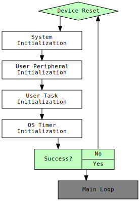

## 1-Getting Started
### Introduction to the Microchip SMPS Firmware Framework Architecture

This power converter firmware is based on a set of standardized software modules, which are initialized and executed by a central, two priority level, cooperative task scheduler. The standardized building blocks (modules) are providing a framework of functions provided by device driver modules, which are tailored to application-specific requirements by configuring their respective data objects.

### 1. Device Startup

  

    Device Startup  
    
  

_________________________________________________
(c) 2020, Microchip Technology Inc.

