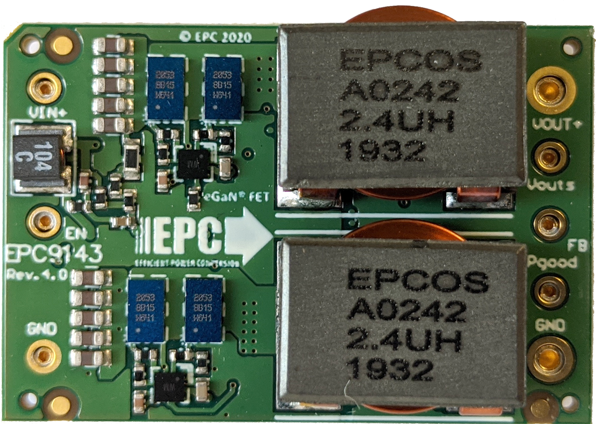
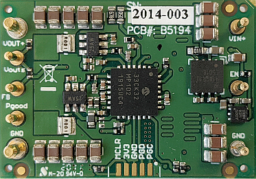
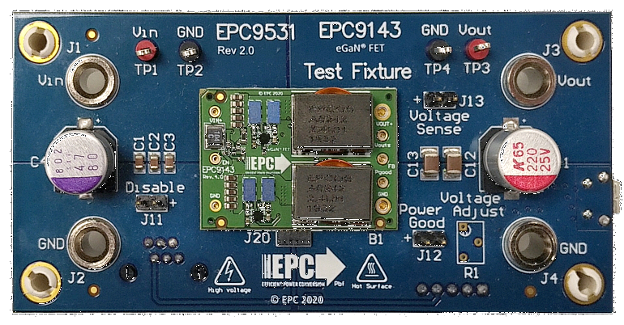
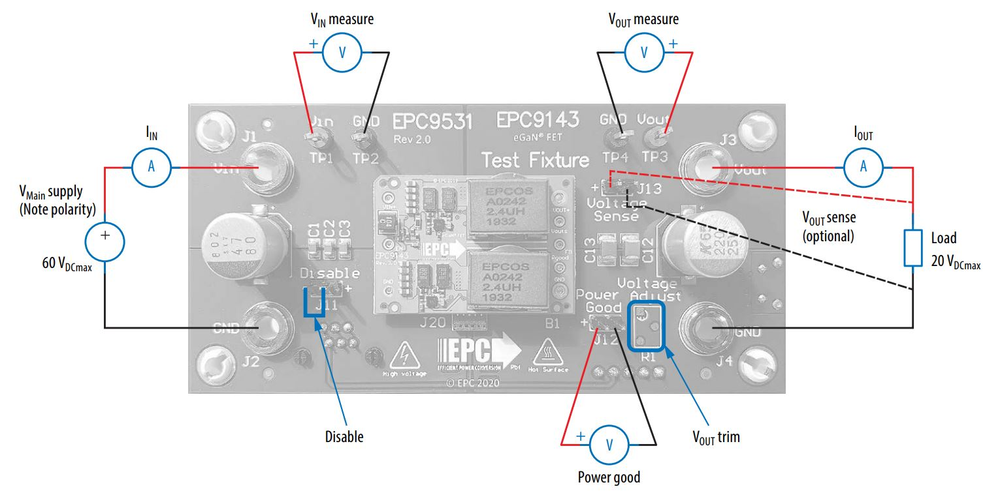
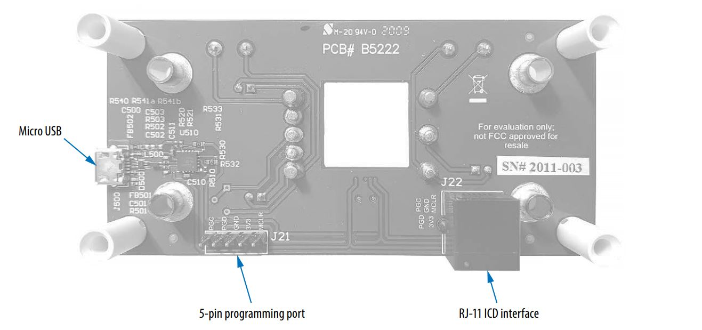
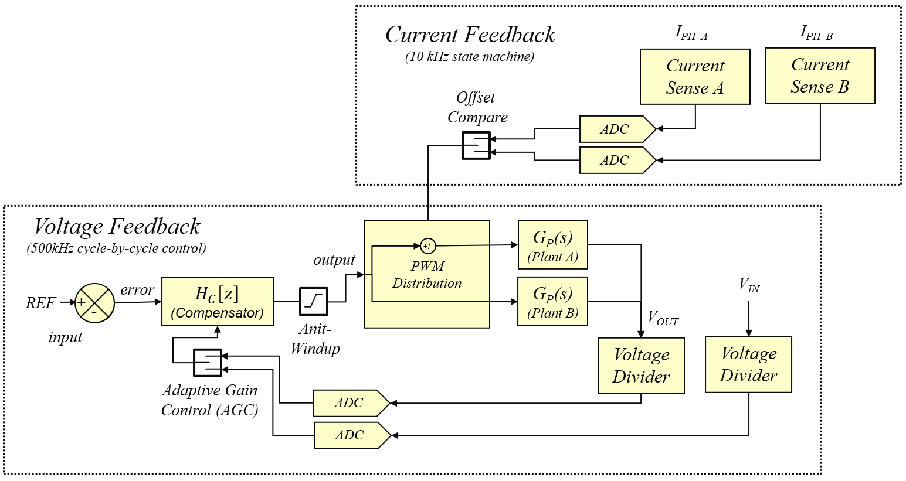

 

## EPC9143 300W 16th Brick Non-Isolated Step Down Converter Advanced Voltage Mode Control Firmware
**2-Phase Synchronous Buck Converter with Advanced Voltage Mode Control and Current Balancing**

<table style="border: none; align:center; width:100%">
<tr>
 <td style="align:center;">
 <td style="text-align:center; vertical-align: bottom; height:230px; width:300px;">  </td>
 <td style="align:center; width:10px"> &nbsp; </td>
 <td style="text-align:center; vertical-align: bottom; height:230px; width:300px">  </td>
 <td style="align:center;">
</tr>
<tr>
 <td style="align:center;">
 <td align=center> <b>Top View</b> </td>
 <td style="align:center;"> &nbsp; </td>
 <td align=center> <b>Bottom View</b></td>
 <td style="align:center;">
</tr>
</table>

## Summary
This code example demonstrates a closed loop voltage mode control implementation for dsPIC33CK. It has specifically been developed for the EPC9143 1/16th brick power module, hardware revision 4.0 (see 'Rev' number printed on board top view shown above for verification).

The board starts up automatically when sufficient power is applied to the input terminals of the board, providing a regulated output voltage of 12 V DC at the output of the converter. The startup procedure is controlled and executed by the power controller state machine and includes a configurable startup procedure with power-on delay, ramp up period and power good delay before dropping into constant regulation mode.

An additional fault handler routine continuously monitors incoming ADC data and peripheral status bits and shuts down the power supply if the input voltage is outside the defined maximum range (UVLO/OVLO) or if the output voltage is more than 0.5 V out of regulation for more than 10 milliseconds.

A single, high-speed type IV (4P4Z) voltage mode controller with enforced PWM steering is used to automatically create balanced phase currents in both phases of this interleaved converter. An underlying current balancing scheme compensates component tolerances and deviations over temperature. A built-in adaptive gain control algorithm stabilizes gain variations of the voltage loop controller during input- and output voltage transients, stabilizing cross-over frequency and output impedance, supporting control bandwidths of 25 kHz, for improved transient response, helping to minimize power distribution network (PDN) decoupling capacity.

#### Product Features:
  - Input Voltage: 18 V to 61 V
  - Output Voltage: 5 ... 15 V DC (12 V default setting)
  - Switching Frequency: 500 kHz
  - Control Frequency: 500 kHz
  - Cross-Over Frequency: ~25 kHz (depends on VIN and if AGC is on/off)
  - Phase Margin: ~ 50°
  - Gain Margin: ~ 12 dB

## Related Documentation
##### Firmware Documentation
  - [EPC9143 Online Firmware Documentation](https://microchip-pic-avr-solutions.github.io/epc9143-power-advanced-voltage-mode-control)

##### Hardware Documentation
- [EPC9143 300W 1/16th brick Power Module Reference Design Product Website](https://www.microchip.com/DevelopmentTools/ProductDetails/PartNO/EPC9143)
  - [EPC9143 Reference Design Quick Start Guide (QSG)](https://epc-co.com/epc/documents/guides/EPC9143_qsg.pdf)
  - [EPC9143 Reference Design Schematics](https://epc-co.com/epc/documents/schematics/EPC9143_Schematic.pdf)
  - [EPC9531 Test Fixture Quick Start Guide (QSG)](https://epc-co.com/epc/documents/guides/EPC9531_qsg.pdf)
  - [EPC9531 Test Fixture Schematics](https://epc-co.com/epc/documents/schematics/EPC9531_Schematic.pdf)

##### Device Support
*Featured Microchip Technology Products:*
- [dsPIC33CK32MP102 Product Website](https://www.microchip.com/dsPIC33CK32MP102)
  - [dsPIC33CKxxMP10x Device Family Data Sheet](https://www.microchip.com/DS70005363)
  - [dsPIC33CKxxMP10x Device Family Silicon Errata and Data Sheet Clarification](https://www.microchip.com/DS80000809)
- [MCP6C02 Shunt Amplifier Product Website](https://www.microchip.com/MCP6C02)
  - [MCP6C02 Zero-Drift, High-Side Current Sense Amplifier](https://www.microchip.com/DS20006129)

*Featured Efficient Power Conversion (EPC) Products:*
- [EPC2053 100 V, 48/246 A Enhancement-Mode GaN Power Transistor](https://epc-co.com/epc/Products/eGaNFETsandICs/EPC2053.aspx)
  - [EPC2053 Data Sheet](https://epc-co.com/epc/Portals/0/epc/documents/datasheets/EPC2053_datasheet.pdf)

## Development Tools 

##### MPLAB® X Integrated Development Environment (IDE)
  - [Requires MPLAB® X IDE, Version v5.40 or later](https://www.microchip.com/mplabx)
    - [Download latest version of MPLAB® X IDE for Windows](https://www.microchip.com/mplabx-ide-windows-installer)
    - [Download latest version of MPLAB® X IDE for Linux](https://www.microchip.com/mplabx-ide-linux-installer)
    - [Download latest version of MPLAB® X IDE for MAC OS](https://www.microchip.com/mplabx-ide-osx-installer)

##### MPLAB® XC16 C-Compiler
  - [Requires MPLAB® XC16 Compiler, Version v1.50 or later](https://www.microchip.com/xc16)
    - [Download latest version of MPLAB® XC16 Compiler for Windows](https://www.microchip.com/mplabxc16windows)
    - [Download latest version of MPLAB® XC16 Compiler for Linux](https://www.microchip.com/mplabxc16linux)
    - [Download latest version of MPLAB® XC16 Compiler for MAC OS](https://www.microchip.com/mplabxc16osx)

##### MPLAB® X PowerSmart™ Digital Control Library Designer
  - [Optional: PowerSmart&trade; - Digital Control Library Designer, v0.9.12.642 or later (Pre-Release Version)](https://areiter128.github.io/DCLD/)
    - [Download latest version of PowerSmart&trade; - DCLD for Windows](https://github.com/areiter128/DCLD/archive/release.zip)

## Hardware Used
The EPC9143 1/16th brick power module is best tested when plugged into EPC9531 test fixture. This test fixture also provides all required interfaces to program and debug the dsPIC33CK32MP102 DSC as well as test points and banana jack connectors for easy and safe handling of the kit during bench tests. The EPC9531 QSG provides detailed operating procedure instructions.

  - EPC9143: EPC9143 16th Brick Non-Isolated Step Down Converter, Revision 4.0
  - EPC9531: EPC9531 test fixture for EPC9143 16th brick reference design

  

    
  

## Setup
The board comes programmed and ready to be used when unpacked. No reprogramming of the target device is required to operate the board unless features or settings such as the nominal output voltage or start-up timing need to be modified. 

  

    
     
    EPC9531 Test Fixture Connections - Top View
  

  

    
     
    EPC9531 Test Fixture Connections - Bottom View
  

In case firmware based features need to be changed, the Microchip dsPIC33CK controller can be re-programmed using the in-circuit serial programming port (ICSP) available on the RJ-11 programming interface as well as the 5-pin header provided by the EPC9531 test fixture. These interfaces support all of Microchip’s in-circuit programmers/debuggers, such as MPLAB® ICD4, MPLAB® REAL ICE or MPLAB® PICkit4 and previous derivatives. See [EPC9531 Quick Start Guide](https://epc-co.com/epc/documents/guides/EPC9531_qsg.pdf) for details.

## Operation
The converter is starting up automatically when more than 10.5 V DC are applied across the input terminals of the EPC9531 test fixture. It is not recommended to operate the EPC9143 reference design without proper decoupling capacitance at either input or output. The EPC9531 test fixture provides the best test environment for the converter. Please read the [EPC9531 Quick Start Guide](https://epc-co.com/epc/documents/guides/EPC9531_qsg.pdf) to get detailed information about the requirements for setup and operation of this reference design.

##### Cycle-by-Cycle Voltage Control Loop

This firmware uses a digital type IV controller to close the feedback loop in voltage mode control. This digital loop reads the most recent ADC sample of the output voltage and processes the derived value through a digital type IV (4P4Z) compensation filter. The numeric output is checked and, when necessary, clamped to user-defined minimum/maximum thresholds before being written to the PWM duty cycle register. As EPC9143 is a multiphase converter, a special PWM steering mode has been implemented supporting high-speed current balancing between the two phases. The voltage mode controller has been extended with a self-adapting loop gain tuning algorithm (AGC) stabilizing the frequency domain characteristic over input voltage, output voltage and load, always providing the exact same bandwidth of >25 kHz and stability margins across the entire operating range.

  

    
     
    EPC9143 Type IV Controller - Advanced Voltage Control Loop
  

This control loop can be turned on/off by using the ENABLE bit in the STATUS word of the cNPNZ_t controller data structure. The adaptive loop gain modulation is permanently active as soon as the control loop is enabled.

The control loop source code is configured and generated by the PowerSmart&trade; - Digital Control Library Designer (DCLD) software.

This additional design software is available for download on Github Pages:

  - [PowerSmart&trade; Digital Control Library Designer Github Page](https://areiter128.github.io/DCLD)

Once installed, the controller configuration can be modified. The most recent configuration can be opened from within the MPLAB X® IDE by right-clicking on the file **'v_loop.dcld'** located in the Important Files folder of the Project Manager. When right-clicked, select **'Open In System'** to open the configuration in PowerSmart&trade; DCLD. 

Please refer to the user guide of PowerSmart&trade; DCLD which is included in the software and can be opened from the help menu of the application.

_________________________________________________
(c) 2020, Microchip Technology Inc.

